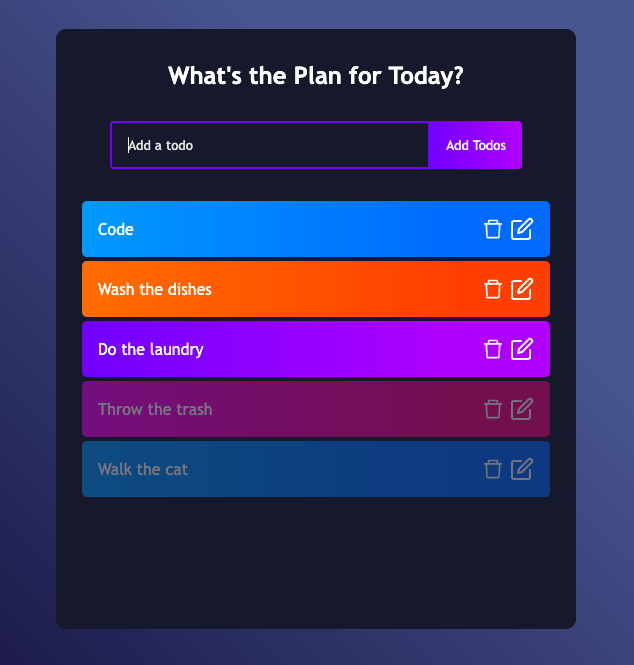

# Small Steps: A Todo App

The Todo app (or Small Steps) is a place to make a list of your tasks or chores for the day. Users can log, update, delete, and mark todos as complete on the Small Steps app. 

## Live Link

[Live Deployment](https://small--steps.herokuapp.com/)

## Techonology Used

- CSS
- JavaScript
- React

## Features

- View of the initial page.

- View of page with tasks to do.

- View while updating a task.

- View of tasks completed.

